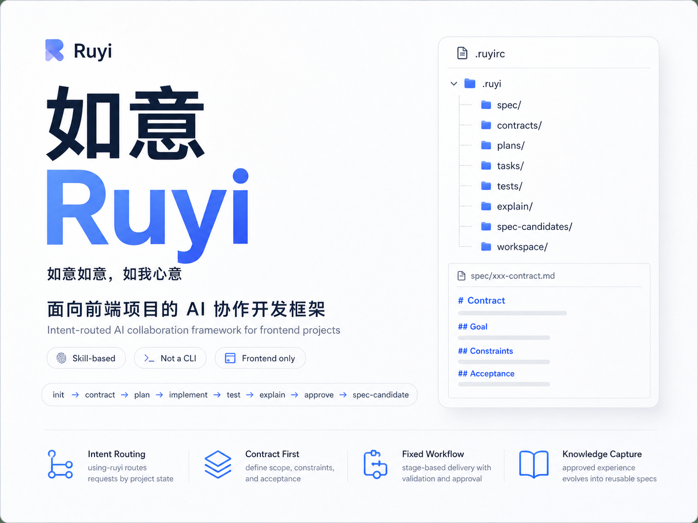

# Ruyi 如意

> A frontend dev contract framework for AI coding agents.
> Forces "requirement -> plan -> implement -> verify -> brief -> approve -> distill" as a hard pipeline so agents cannot skip stages or fake completion.

Ruyi 是一个面向前端项目的 AI 协作开发框架，以 code agent skill 包的形式提供固定开发流程、项目知识沉淀和轻量脚本辅助。

它不是 CLI 产品。用户不需要记命令；日常使用时由 agent 通过 `using-ruyi` 判断当前项目状态、识别用户意图，并路由到对应阶段。

## 核心目标

- 让前端需求从“口头描述”进入可追踪的 contract。
- 让编码、验证、开发简报、审批和知识沉淀按固定阶段推进。
- 让项目长期规则沉淀到 `.ruyi/spec/`，让单次需求留在 `contract / task / test / explain`。
- 让 agent 不跳过需求定义、验证证据和审批确认。

## 支持范围

首版只支持前端项目：

- Vue
- Vite
- React
- Webpack
- 常见 JS/TS 组合

非前端项目应拒绝初始化。

## Skill 结构

```text
assets/
└── ruyi-home.png
skills/
├── using-ruyi/
├── ruyi-init/
├── ruyi-contract/
├── ruyi-plan/
├── ruyi-implement/
├── ruyi-test/
├── ruyi-explain/
├── ruyi-approve/
├── ruyi-spec-discover/
├── ruyi-spec-evolve/
└── ruyi-spec-merge/
```

`using-ruyi` 是入口 skill。其他 skill 只负责各自阶段。

安装时把 `skills/` 文件夹里的内容放到目标 code agent 的 skills 目录即可。每个 skill 都带自己的 `references/`，不依赖共享目录，方便 Trae、Claude Code CLI 等工具直接识别。

## 分层模型

Ruyi 有三层，不应该混在一起：

- `skills/`：Ruyi 本体 skill 包，提供固定主流程、协议 schema、阶段 skill 和辅助脚本。
- `.ruyi/`：项目级知识层，放在具体业务项目根目录，记录当前项目的规范、需求、计划、验证、简报和沉淀候选。
- `ruyi-team/`：团队级知识层，可选存在，用于放团队统一规范、跨项目经验、团队动作和公共约束。

项目初始化时主要读取当前项目，不要求存在 `ruyi-team/`。团队级信息是在协作开发过程中由 agent 按需读取，用来和项目级规范合并判断。

推荐团队层结构：

```text
ruyi-team/
├── spec/
├── actions.md
└── README.md
```

其中：

- `spec/`：团队长期有效规范，例如前端工程规范、测试要求、组件设计原则、交互约束。
- `actions.md`：团队特殊动作，例如测试报告提交位置、审批系统地址、发布前检查方式。
- `README.md`：团队层说明，帮助 agent 判断这份团队知识适用范围。

当团队层与项目层存在同类规范时，agent 应按规则合并：项目级描述具体事实，团队级描述通用约束；冲突时不能简单覆盖，应整理为更清晰的项目规则或团队候选，再让人确认。

## 主流程

Ruyi 固定主流程：

1. 初始化：生成 `.ruyirc` 和 `.ruyi/`。
2. 需求定义：生成 `contract`。
3. 开发计划：生成 `plan` 与必要 `task`。
4. 编码实现：代码变更、实现自检和代码质量结论。
5. 测试验证：生成 `test`。
6. 开发简报：生成 `explain`。
7. 审批：更新 explain 中的 `approval`。
8. 知识沉淀：生成 `spec-candidate`。

项目不能改写主流程，只能通过 `.ruyi/project-actions.md` 追加项目特殊动作。

## 项目层结构

初始化后的项目会包含：

```text
.ruyirc
.ruyi/
├── spec/
│   ├── INDEX.md
│   ├── project-overview.md
│   ├── project-structure.md
│   ├── development-baseline.md
│   ├── coding-baseline.md
│   ├── testing-baseline.md
│   ├── api.md
│   ├── open-questions.md
│   ├── docs-registry.md
│   ├── interview-bank.md
│   └── references/
│       ├── shared/
│       └── modules/
├── contracts/
├── plans/
├── tasks/
├── tests/
├── explain/
├── spec-candidates/  # local, gitignored
├── spec-archive/     # local, gitignored
├── spec-patches/     # local, gitignored
├── workspace/
├── INDEX.md
├── project-actions.md
└── README.md
.claude/
└── commands/
    └── ruyi.md
CLAUDE.md
```

其中：

- `spec/`：项目长期有效事实和规范。
- `spec/docs-registry.md`：成熟项目接入时保留下来的高价值外部文档入口。
- `spec/interview-bank.md`：init 和后续 contract 阶段确认过的项目关键问卷答案。
- `spec/development-baseline.md`：开发过程约束，例如必须运行的检查。
- `spec/coding-baseline.md`：代码编写约束。
- `spec/api.md`：长期 API 约定和外部权威 API 文档入口，不维护完整接口列表。
- `spec/references/shared/`：跨模块共享规范。
- `spec/references/modules/`：具体模块、页面、功能或公共组件规范。
- `contracts/`：某次需求的设计与验收定义。
- `plans/`：围绕 contract 的开发计划、测试策略和 task 拆分。
- `tasks/`：围绕 plan 的执行单元。
- `tests/`：某次 contract 的正式验证结果。
- `explain/`：面向 PM 的开发简报。
- `spec-candidates/`：本地临时知识沉淀候选，默认不提交 git；agent 读取正式 spec 时可按需读取，但不能覆盖正式 spec。
- `spec-archive/`：本地 candidate 处理归档，默认不提交 git。
- `spec-patches/`：本地人工合入补丁，默认不提交 git；确认后应把真正规则合入正式 spec。
- `workspace/`：临时过程材料，默认不提交正式内容。
- `INDEX.md`：跨需求轻量索引，Ritual 阶段优先读取它，不扫全部产物。
- `.claude/` 与 `CLAUDE.md`：入口保护和手动兜底。

## 使用方式

把 `skills/` 文件夹里的内容复制或链接到目标 code agent 可用的 skills 目录后，在项目中对 agent 说自然语言目标即可，例如：

- “把这个 Vue 项目接入 Ruyi。”
- “新增订单关键词搜索。”
- “继续。”
- “生成开发简报。”
- “这个交付通过。”
- “把这次经验沉淀一下。”

agent 应先加载 `using-ruyi`，再根据项目状态和用户意图路由到具体阶段。

Ruyi 初始化后会部署三层入口保护：

- `.claude/settings.json`：在 Claude Code 中通过 UserPromptSubmit hook 注入 Ruyi reminder。
- `CLAUDE.md`：提供项目级持久提示，降低长对话中漏走 Ruyi 的概率。
- `.claude/commands/ruyi.md`：提供 `/ruyi` 手动兜底命令。

如果发现 agent 没有走 Ruyi 流程，可以输入 `/ruyi` 强制激活。

成熟项目接入时，Ruyi 不倒灌历史 contract。`ruyi-init` 提供两种方式：快速开始只启用流程，历史知识后续按需补；完整迁移会蒸馏现有文档并澄清关键问题，生成项目知识基线。

## 安装

Ruyi 仿照 Superpowers 的安装思路：保留完整仓库目录，把 `skills/` 文件夹里的内容放到目标 code agent 可发现的 skills 目录。

复制安装：

```powershell
New-Item -ItemType Directory -Force -Path "$env:USERPROFILE\.agents\skills"
Copy-Item -Recurse -Force ".\skills\*" "$env:USERPROFILE\.agents\skills\"
```

本地开发时也可以分别建立目录联接，避免复制后忘记同步：

```powershell
cmd /c mklink /J "%USERPROFILE%\.agents\skills\using-ruyi" "D:\AIWorks\ruyi\skills\using-ruyi"
cmd /c mklink /J "%USERPROFILE%\.agents\skills\ruyi-init" "D:\AIWorks\ruyi\skills\ruyi-init"
```

其他阶段 skill 按同样方式链接。安装后重启 code agent。

## 入口路由

路由由 agent 按 `using-ruyi/SKILL.md` 的路由判定表直接判断。Python 脚本只是可选复核工具，不是必经入口。

可选复核：

```powershell
python .\skills\using-ruyi\scripts\route_request.py --project <project> --intent continue --module <module> --feature <feature> --date <YYYY-MM-DD>
```

脚本只判断下一阶段，不生成正式产物。自然语言意图仍由 agent 判断。Python 不可用时，agent 必须按 schema 和路由判定表直接读取 `.ruyi/`，不能绕过门禁。

Ritual 阶段只读 `.ruyi/INDEX.md`；路由确定到具体 feature 前，不读取多个 contract / plan / explain 正文。

## 阶段脚本

当前最小脚本链：

```text
ruyi-init        初始化项目
ruyi-contract    创建 contract
ruyi-plan        创建 plan
ruyi-implement   创建 task
ruyi-test        创建 test
ruyi-explain     创建 explain
ruyi-approve     更新 explain 审批状态
ruyi-spec-discover 从现有代码反推本地 spec-candidate
ruyi-spec-evolve 创建 spec-candidate
ruyi-spec-merge  周期性人工合入 spec-candidate
```

这些脚本用于稳定写入协议产物，不替代 agent 的需求澄清、编码实现、测试判断和审批沟通。

运行时 fallback 见 [skills/using-ruyi/references/script-runtime-protocol.md](skills/using-ruyi/references/script-runtime-protocol.md)。

## API 文档归位

Ruyi 不维护后端 API 文档本体，只维护三类信息：

- `.ruyi/spec/api.md`：长期 API 约定和权威源入口，例如 Swagger / Apifox / Yapi / OpenAPI 链接。
- `contract` 的 `## 接口范围`：本次需求涉及哪些接口、新增/修改/复用/废弃。
- `plan` 的 `## 接口对接`：前端如何接 service、类型、mock、错误处理和状态管理。

完整请求响应结构应留在后端权威源；只有前端先行的临时定义可以短期写入 contract，并标注来源和替换时机。

## 当前状态

首版最小主流程已经跑通：

```text
init -> contract -> plan -> task/implement -> test -> explain -> approve -> spec-candidate
```

开发仓库中已用两个示例需求验证：

- `board/card-status-filter`
- `orders/order-keyword-search`

同时验证了失败/退回场景：

- `board/missing-acceptance`：contract 缺验收标准，阻止进入 plan。
- `orders/orphan-plan`：孤立 plan，阻止进入 implement。
- `board/failed-test`：test failed，阻止进入 explain。
- `orders/no-test-evidence`：explain 风险缺少 test 证据，lint 拒绝。
- `board/premature`：approval pending，阻止 spec-evolve。
- `board/copy-tweak`：tiny 分档示例，完成 contract -> test 的轻量路径。

## 后续重点

- 继续在真实项目中压测 `tiny / standard / large` 分档边界。
- 为高频写入脚本补充 `.mjs` 等价实现，进一步降低 Python 环境依赖。
- 将 fast-browser case/flow/site 与 `ruyi-test` 深度联动。
- 建立自动化的 EXPECTED fixture 评分机制。
